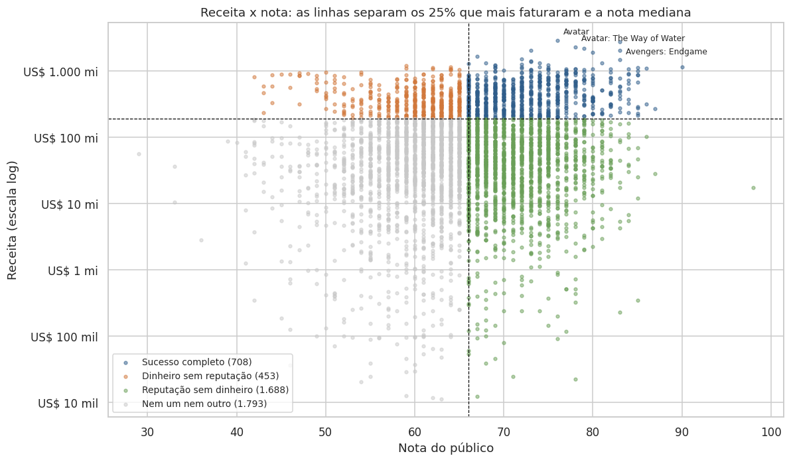
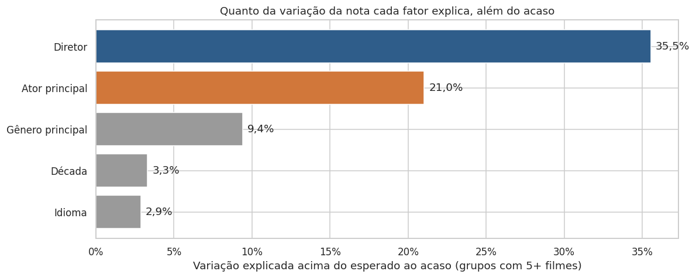
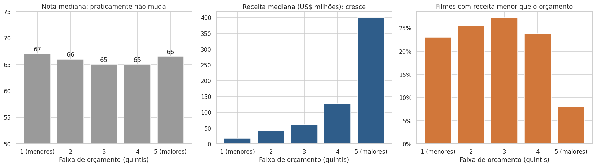
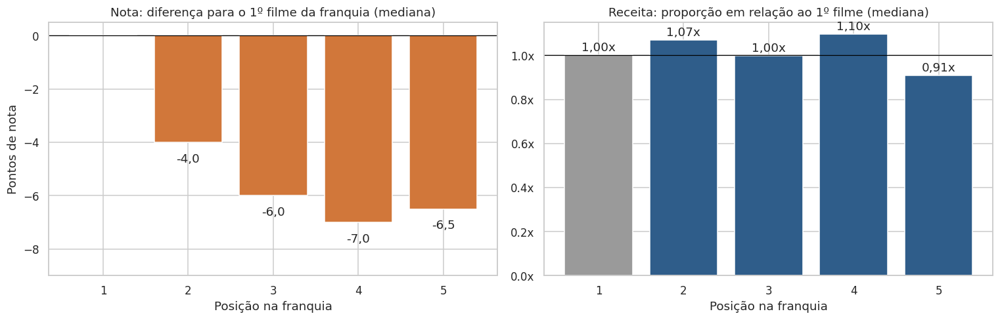

# Projeto_An-lise_BasedeDadosIMDB

# Filmes: reputação x retorno financeiro

Análise de 10.178 filmes da base IMDB Movies (Kaggle), enriquecida com dados da Wikipedia e do Wikidata, para responder a uma pergunta de negócio: **o que faz um filme ser bem avaliado, o que faz um filme dar retorno financeiro e onde essas duas coisas não andam juntas.**

Projeto desenvolvido no Treinamento de Exploração e Análise de Dados, a partir das perguntas de negócio propostas por Regilene.

## Principais resultados

| Achado | Evidência |
|---|---|
| Reputação e dinheiro quase não andam juntos | Correlação entre nota e receita de 0,14 |
| Orçamento compra segurança, não qualidade | Orçamento x nota: -0,04. Orçamento x receita: 0,70. Na maior faixa de orçamento, 8% tiveram receita menor que o custo; nas demais, de 23% a 27% |
| Quem dirige pesa mais na nota do que quem atua | O diretor explica 35,5% da variação da nota, além do acaso; o ator principal, 21,0% |
| Existe um padrão de sucesso por diretor | 116 diretores superam a nota esperada em pelo menos 80% dos filmes, contra cerca de 49 esperados por acaso |
| Franquia transfere dinheiro, mas não qualidade | A receita das continuações fica entre 0,91x e 1,10x a do primeiro filme; a nota cai de 4 a 7 pontos |
| O retorno por dólar é o mais difícil de prever | Nenhum fator explica mais de 6,3% do ROI |

## O contexto

Um cliente que produz e distribui filmes quer decidir onde investir. Nota alta não garante dinheiro, e dinheiro não garante reputação. As 9 perguntas de negócio estão divididas em três blocos:

| Bloco | Perguntas |
|---|---|
| Entendendo o cenário | P1. O que, além do gênero, influencia a nota? P2. O que faltou na base, e como conseguir? |
| Aceitação do público | P3. O que os filmes mais bem avaliados têm em comum? P4. A informação sobre quem trabalhou nos filmes é suficiente? P5. Existe um padrão de sucesso ligado a quem faz os filmes? |
| Retorno x aceitação | P6. Quem mais fatura é quem tem melhor nota? P7. Por que alguns filmes faturam muito com nota mediana? P8. Filmes da mesma série se comportam de forma parecida? P9. Orçamento maior significa nota maior? |

## Os dados

| Fonte | Uso |
|---|---|
| [IMDB Movies Dataset (Kaggle)](https://www.kaggle.com/datasets/ashpalsingh1525/imdb-movies-dataset) | Base original: 10.178 linhas, 12 colunas, filmes de 1903 a 2023 |
| [Wikipedia: List of film remakes](https://en.wikipedia.org/wiki/List_of_film_remakes_(A%E2%80%93M)) | Identificação de 213 remakes |
| [Wikidata](https://www.wikidata.org/) | Diretor de 7.787 filmes (80% da base) e um identificador único por filme |

## Como o trabalho foi feito

1. **Diagnóstico de qualidade** antes de qualquer análise.
2. **Limpeza e padronização**, com cada decisão documentada no notebook.
3. **Enriquecimento** com remakes da Wikipedia e diretores do Wikidata, consultado por SPARQL em lotes de 100 títulos.
4. **Regra de confiabilidade financeira**, que separa os filmes com receita e orçamento consistentes.
5. **Análise das 9 perguntas**, cada uma com gráfico, leitura e uma conclusão prática ("e daí?").

A análise usa duas bases: **9.790 filmes** para tudo o que envolve nota e **4.642 filmes (47%)** para tudo o que envolve dinheiro.

## Principais desafios

| Desafio | O que encontrei | Como resolvi |
|---|---|---|
| Dados financeiros fabricados | 33,4% das receitas com centavos; o valor US$ 175.269.998,80 repetido em 143 filmes; os cinco filmes com nota 100 com orçamento e receita idênticos | Regra de confiabilidade: só os 4.642 filmes que passam em todos os testes entram nas análises de dinheiro |
| Bilheteria trocada entre filmes | 166 filmes duplicados com receitas diferentes; *Titanic* (1953) com a receita do *Titanic* (1997) | 177 linhas duplicadas removidas; 166 conflitos e 212 homônimos excluídos das análises financeiras |
| Coluna "equipe" sem equipe | A coluna `crew` só trazia atores e personagens | Diretor trazido do Wikidata |
| Filtro enviesado | A primeira regra exigia orçamento múltiplo de US$ 1 milhão e cortava filmes baratos e bem avaliados | Regra revisada: o subconjunto financeiro passou de 3.838 para 4.642 filmes |
| Sem número de votos | Uma nota 100 dada por 3 pessoas pesa igual a uma nota 87 dada por milhões | Filmes com bilheteria registrada usados como base com plateia real |

## Achados em gráficos

**Quanto cada fator explica da nota, além do acaso**

**Orçamento: a nota não muda, o risco sim**

**Franquias: a receita se mantém, a nota cai**

Os 12 gráficos do projeto estão na pasta [`imagens`](imagens), na ordem em que aparecem no notebook. A explicação de cada um está no relatório.

## Recomendações

| Se o objetivo é | Apostar em | Por quê |
|---|---|---|
| Retorno previsível | Continuações de franquias estabelecidas | Receita estável, com perda de 4 a 7 pontos de nota |
| Retorno alto com pouco capital | Terror de baixo orçamento | Maior ROI mediano entre os gêneros (3,32), com a menor nota (61) |
| Segurança de bilheteria | Orçamentos da faixa mais alta | Só 8% com receita abaixo do orçamento |
| Equilíbrio | Animação | Único gênero com sinal positivo em nota, receita e ROI |
| Reputação e retorno juntos | Diretores com histórico consistente | 122 diretores com nota acima do esperado e ROI acima da mediana |

## Limitações

- Só 47% da base tem dado financeiro confiável, e esse subconjunto ainda tem receitas implausíveis que passaram nos testes.
- A base não tem o número de votos de cada filme.
- O diretor foi encontrado para 80% dos filmes; roteirista, produtor e estúdio ficaram de fora.
- As franquias foram identificadas pelo título.
- O ROI usa bilheteria bruta e orçamento sem marketing, por isso serve para comparar grupos, não para medir o lucro de cada filme.
- Correlação não mostra causa.

## Próximos passos

1. Conferir bilheteria e custo no Wikidata (propriedades P2142 e P2130).
2. Trazer o número de votos do arquivo `title.ratings` do IMDb.
3. Repetir o teste de diretores para roteiristas, produtores e estúdios (P58, P162 e P272).
4. Substituir a franquia por título pela série oficial (P179).
5. Construir um dashboard a partir dos arquivos já exportados.

## Estrutura do repositório

| Arquivo | Conteúdo |
|---|---|
| [`Projeto_imdb.ipynb`](Projeto_imdb.ipynb) | Notebook completo: diagnóstico, limpeza, enriquecimento, as 9 perguntas e as conclusões |
| [`Relatorio_ProjetoAnaliseIMDB.pdf`](Relatorio_ProjetoAnaliseIMDB.pdf) | Relatório no método STAR, com a explicação de cada gráfico |
| [`Dicionário de dados Filmes, reputação x retorno financeiro.pdf`](Dicion%C3%A1rio%20de%20dados%20Filmes%2C%20reputa%C3%A7%C3%A3o%20x%20retorno%20financeiro.pdf) | Definição de cada coluna e de cada termo do projeto |
| [`Apresentacao_IMDb_Danielli_Arcari.pptx`](Apresentacao_IMDb_Danielli_Arcari.pptx) | Apresentação de 15 minutos para público não técnico |
| [`arquivosCSV/imdb_movies.csv`](arquivosCSV/imdb_movies.csv) | Base original do Kaggle |
| [`arquivosCSV/imdb_limpo.csv`](arquivosCSV/imdb_limpo.csv) | Base limpa: 9.790 filmes, 29 colunas |
| [`arquivosCSV/imdb_analitico.csv`](arquivosCSV/imdb_analitico.csv) | Base com todas as colunas de análise, pronta para dashboard: 41 colunas, separador `;` e decimal `,` |
| [`arquivosCSV/ranking_diretores.csv`](arquivosCSV/ranking_diretores.csv) | 384 diretores com 5 ou mais filmes, com nota acima do esperado e ROI mediano |
| [`arquivosCSV/diretores_wikidata.csv`](arquivosCSV/diretores_wikidata.csv) | Resultado da consulta ao Wikidata, usado como cache |
| [`imagens/`](imagens) | Os 12 gráficos do notebook |

## Como reproduzir

1. Abra o notebook no Google Colab pelo botão no topo desta página.
2. Crie uma pasta no seu Google Drive e copie para ela `imdb_movies.csv` e `diretores_wikidata.csv`.
3. Na primeira célula de código, troque o valor de `PASTA` pelo caminho dessa pasta (o original é `/content/drive/MyDrive/TreinamentoNycollasRegilene`).
4. Execute todas as células. A leitura dos remakes acessa a Wikipedia, então o Colab precisa de internet. O Wikidata não é consultado de novo enquanto o arquivo `diretores_wikidata.csv` estiver na pasta.

## Ferramentas

Python (pandas, NumPy, Matplotlib, Seaborn, requests), SPARQL e Google Colab.

## Autora

**Danielli Arçari**

[LinkedIn](https://linkedin.com/in/danielli-arcari) | [GitHub](https://github.com/danielli-arcari) | [Portfólio](https://danielliarcari.vercel.app)
